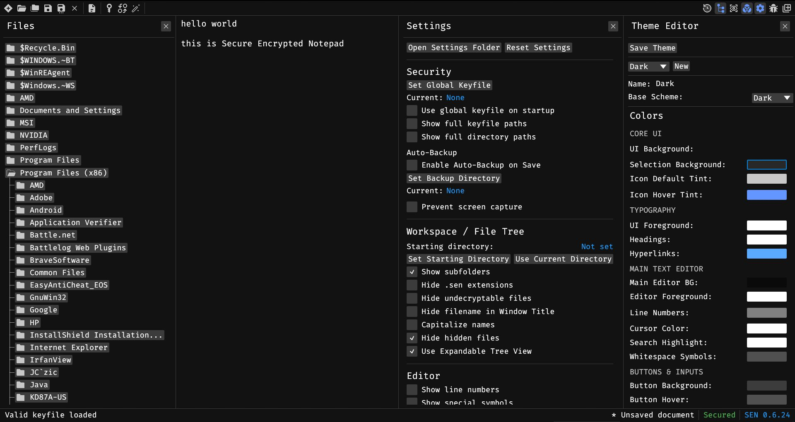

# 🔐 SEN - Secure Encrypted Notepad

**SEN** is a local-first application built in **Rust** for Desktop and Android, designed for security. It uses **keyfile-only authentication** instead of passwords, ensuring that your documents cannot be decrypted without physical access to your unique keyfile.

🚧 Please note that **SEN** is still in development. While the core functionality for both Desktop and Mobile is in place, you may encounter bugs or missing features.

---

## 📚 Documentation

For detailed information, check out the following guides in the `/docs` directory:
- [Encryption Architecture](docs/encryption_architecture.md) – Technical details on how your data is protected.
- [Development Guide](docs/development.md) – Instructions on how to set up the environment and build the project for Desktop and Android.
- [Project TODO](docs/todo.md) – A list of planned features and known issues.

---

## 🖥️ Platform Support

| Platform | Architecture | Target | Security Backend |
|----------|-------------|--------|-----------------|
| Windows | x86_64 | `x86_64-pc-windows-msvc` | Windows Credential Manager |
| Linux | x86_64 | `x86_64-unknown-linux-gnu` | libsecret / KWallet |
| macOS | Universal | `x86_64` / `aarch64`-apple-darwin | Keychain Access |
| Android | ARM64 / x86 | `aarch64` / `x86_64`-linux-android | Android Keystore & Biometrics |

> **Portable:** Desktop SEN is a single self-contained binary — no installation required. Just download and run.  
> **Mobile:** The Android version integrates with the System File Picker (SAF) and supports biometric unlock.
> **Linux note:** Requires a running secret service daemon (e.g. `gnome-keyring` or `kwallet`).

---

## ⚠️ Important Disclaimer

**Losing or modifying your keyfile means permanently losing access to your encrypted files.** So always back up your keyfiles securely and use app at your own risk.
