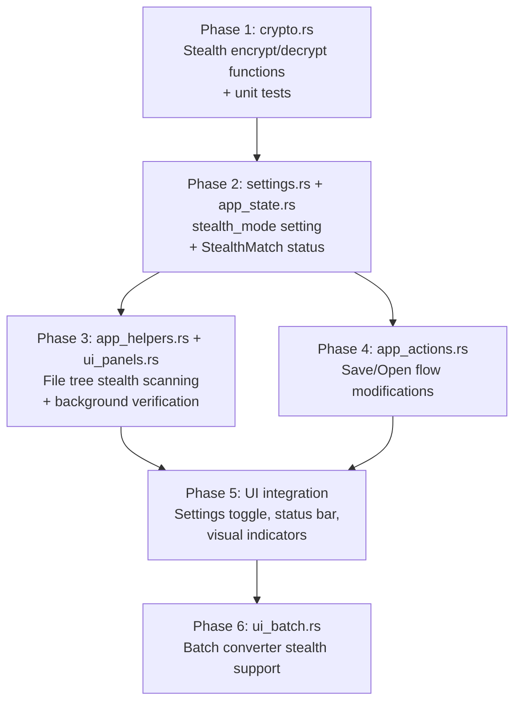

# Stealth Mode — Implementation Proposal

## Problem Statement

Currently, every SEN-encrypted file has two identifying markers:
1. The `.sen` file extension
2. The `SEN1` magic number (first 4 bytes of the file)

Anyone who examines the file can immediately identify it as a SEN document. Stealth Mode eliminates both markers, making the file **indistinguishable from random binary noise**.

---

## Current File Format (Standard)

```
┌──────────┬──────────┬──────────────────────────────────┐
│ SEN1 (4B)│ Salt(32B)│  XChaCha20-Poly1305 ciphertext   │
└──────────┴──────────┴──────────────────────────────────┘
  ↑ magic     ↑ random        ↑ authenticated encryption
  IDENTIFIABLE               (already looks like noise)
```

## Stealth File Format (Proposed)

```
┌──────────┬──────────────────────────────────┐
│ Salt(32B)│  XChaCha20-Poly1305 ciphertext   │
└──────────┴──────────────────────────────────┘
  ↑ random        ↑ authenticated encryption
  ALL BYTES ARE INDISTINGUISHABLE FROM RANDOM
```

The **only** difference: the 4-byte `SEN1` magic header is removed. The salt is already random, the ciphertext is already indistinguishable from noise. No extension, no header — pure binary.

---

## Architecture Overview

### What Changes

| Component | Change | Scope |
|---|---|---|
| **crypto.rs** | New `encrypt_stealth` / `decrypt_stealth` functions (no magic header) | Small addition |
| **app_actions.rs** | Modified save flow to support stealth mode toggle | Medium |
| **app_state.rs** | New `KeyStatus::StealthDecryptable` variant | Tiny |
| **settings.rs** | New `stealth_mode: bool` setting | Tiny |
| **ui_panels.rs** (file tree) | Background trial-decryption for extensionless files | Medium |
| **app_helpers.rs** | Extended access check to include stealth verification | Medium |
| **ui_toolbar.rs / ui_panels.rs** | Stealth mode toggle in settings + visual indicator | Small |
| **ui_batch.rs** | Support stealth files in batch converter | Medium |
| **locales/en.yml** | New i18n strings for stealth mode | Small |

### What Does NOT Change

- The standard `.sen` format — fully backward compatible
- The keyfile system — same keyfiles work for both modes
- The history/versioning system — embedded inside the encrypted payload, untouched
- Config encryption (`.keyfile_key`) — completely separate concern

---

## Detailed Steps

### Phase 1 — Crypto Layer (`crypto.rs`)

> [!IMPORTANT]
> Keep the existing `encrypt_file` / `decrypt_file` / `encrypt_bytes` / `decrypt_bytes` functions **untouched**. Add new parallel functions.

#### 1.1 New encryption function

```rust
/// Encrypt in stealth mode: [SALT(32B)][CIPHERTEXT] — no magic header.
pub fn encrypt_stealth(
    content_bytes: &[u8],
    keyfile_path: &Path,
    output_path: &Path,
) -> Result<(), CryptoError> {
    let mut salt = [0u8; SALT_SIZE];
    rand::rng().fill_bytes(&mut salt);

    let keyfile_hash = hash_keyfile(keyfile_path)?;
    let secret_key = derive_key_from_keyfile(&keyfile_hash, &salt)?;

    // Same payload: [keyfile_hash(32B)] + [content]
    let mut payload = Zeroizing::new(Vec::with_capacity(KEYFILE_HASH_SIZE + content_bytes.len()));
    payload.extend_from_slice(keyfile_hash.as_bytes());
    payload.extend_from_slice(content_bytes);

    let ciphertext = aead::seal(&secret_key, &payload)?;

    // NO magic header — just salt + ciphertext
    let mut file_data = Vec::with_capacity(SALT_SIZE + ciphertext.len());
    file_data.extend_from_slice(&salt);
    file_data.extend_from_slice(&ciphertext);

    fs::write(output_path, file_data)?;
    Ok(())
}
```

#### 1.2 New decryption function

```rust
/// Decrypt a stealth file: [SALT(32B)][CIPHERTEXT] — no magic header.
/// Returns Err if the keyfile doesn't match or data is corrupted.
pub fn decrypt_stealth(
    keyfile_path: &Path,
    encrypted_file_path: &Path,
) -> Result<Vec<u8>, CryptoError> {
    let file_data = fs::read(encrypted_file_path)?;

    if file_data.len() < SALT_SIZE + 1 {
        return Err(CryptoError::InvalidFormat);
    }

    let salt = &file_data[..SALT_SIZE];
    let encrypted_data = &file_data[SALT_SIZE..];

    let keyfile_hash = hash_keyfile(keyfile_path)?;
    let secret_key = derive_key_from_keyfile(&keyfile_hash, salt)?;

    let plaintext_bytes =
        aead::open(&secret_key, encrypted_data).map_err(|_| CryptoError::DecryptionFailed)?;
    let plaintext = Zeroizing::new(plaintext_bytes);

    if plaintext.len() < KEYFILE_HASH_SIZE {
        return Err(CryptoError::InvalidFormat);
    }

    let stored_hash = &plaintext[..KEYFILE_HASH_SIZE];
    if keyfile_hash.as_bytes() != stored_hash {
        return Err(CryptoError::KeyfileError(
            "Keyfile mismatch".to_string(),
        ));
    }

    Ok(plaintext[KEYFILE_HASH_SIZE..].to_vec())
}
```

#### 1.3 Trial decryption for file tree identification

```rust
/// Attempt to decrypt a file as stealth format.
/// Used for background verification in the file tree.
/// Returns Ok(true) if the file is a valid stealth SEN file decryptable
/// with the given keyfile hash.
pub fn check_stealth_compatibility(
    keyfile_hash: &[u8; 32],
    file_path: &Path,
) -> Result<bool, CryptoError> {
    let file_data = fs::read(file_path)?;

    if file_data.len() < SALT_SIZE + KEYFILE_HASH_SIZE + 16 {
        return Ok(false); // Too small to be a stealth file
    }

    // Skip files that start with known magic numbers (SEN1, PNG, ZIP, etc.)
    // to avoid wasting time on obviously non-stealth files
    if is_known_format(&file_data[..4]) {
        return Ok(false);
    }

    let salt = &file_data[..SALT_SIZE];
    let encrypted_data = &file_data[SALT_SIZE..];

    let k_hash = KeyfileHash::from_slice(keyfile_hash);
    let secret_key = derive_key_from_keyfile(&k_hash, salt)?;

    match aead::open(&secret_key, encrypted_data) {
        Ok(plaintext) => {
            if plaintext.len() < KEYFILE_HASH_SIZE {
                return Ok(false);
            }
            Ok(&plaintext[..KEYFILE_HASH_SIZE] == keyfile_hash)
        }
        Err(_) => Ok(false), // Not a stealth file or wrong key
    }
}

/// Quick reject: skip files that start with known magic numbers
fn is_known_format(header: &[u8]) -> bool {
    if header.len() < 4 { return false; }
    matches!(
        &header[..4],
        b"SEN1" | b"\x89PNG" | b"PK\x03\x04" | b"%PDF"
        | b"GIF8" | b"\xFF\xD8\xFF\xE0" | b"RIFF"
        | b"\x7FELF" | b"MZ\x90\x00"
    )
}
```

> [!WARNING]
> `check_stealth_compatibility` performs **full decryption** (the KDF is expensive — Argon2id with 3 iterations and ~19 MB memory). This is the most performance-critical part of the implementation. This is why it needs background threading with rate limiting (see Phase 3).

#### 1.4 New unit tests

Add tests for:
- Stealth encrypt/decrypt roundtrip
- Stealth file with wrong keyfile fails
- Stealth file is not identified as standard SEN (`is_sen_file` returns false)
- Standard SEN file is not identified as stealth (magic header causes rejection)
- `check_stealth_compatibility` correctly identifies stealth files
- File too small for stealth format returns `Ok(false)`, not an error

---

### Phase 2 — Settings & State

#### 2.1 `settings.rs` — New setting

```rust
/// Stealth mode: save without .sen extension and SEN1 header
#[serde(default)]
pub stealth_mode: bool,
```

Default: `false`. Add to `Default::default()` impl.

#### 2.2 `app_state.rs` — No changes needed

`KeyStatus` already has `Decryptable` and `WrongKey`. Stealth-verified files can reuse `Decryptable` — the file tree just needs to know whether to display them, regardless of format.

However, consider adding a field to distinguish how the file was identified:

```rust
/// Status of file access relative to currently loaded key
#[derive(Debug, Clone, Copy, PartialEq, Eq)]
pub enum KeyStatus {
    Unknown,      // Not checked yet
    Decryptable,  // Standard SEN, matches current keyfile
    StealthMatch, // Stealth file, matches current keyfile
    WrongKey,     // Keyfile doesn't match
    NotSen,       // Not a SEN file (neither standard nor stealth)
}
```

This lets the file tree use **different icons** for stealth vs standard files (e.g. a ghost icon 👻 or a faded lock icon).

---

### Phase 3 — File Tree Integration (`app_helpers.rs`, `ui_panels.rs`)

This is the **most complex part** because stealth file identification requires expensive trial decryption.

#### 3.1 Modified `refresh_file_access_status()`

Currently, only `.sen` files are checked. With stealth mode:

```
For each file in file_tree:
  1. If extension is .sen → check via standard check_key_compatibility (fast: reads magic)
  2. If extension is NOT .sen AND stealth mode is enabled:
     a. Skip known binary formats (quick header check)
     b. Skip files > configured size limit (e.g., 50 MB)
     c. Queue for background stealth trial-decryption
```

#### 3.2 Background stealth verification (rate-limited)

The Argon2id KDF is **deliberately expensive** (~50-200ms per file depending on hardware). For a directory with 1000 non-.sen files, this could take minutes. Strategy:

```
┌─ Stealth Verification Pipeline ────────────────────────┐
│                                                         │
│  1. Filter: skip .sen, skip known formats, skip >50MB   │
│  2. Sort by file size (smallest first — faster checks)  │
│  3. Process in batches of N files via thread pool        │
│  4. Report results via existing mpsc channel             │
│  5. Cache results in HashMap<PathBuf, KeyStatus>         │
│     (invalidated on keyfile change or file modification) │
│                                                         │
│  Rate limiting: max 4 concurrent checks to avoid        │
│  CPU saturation (Argon2id is memory-hard)               │
└─────────────────────────────────────────────────────────┘
```

#### 3.3 File tree display

| File state | Icon | Color | Behavior |
|---|---|---|---|
| `.sen` + Decryptable | 🔓 (unlocked) | Green | Click to open (existing behavior) |
| `.sen` + WrongKey | 🔒 (locked) | Red | Show warning (existing behavior) |
| Stealth + Matched | 🔓 or 👻 | Green/Cyan | Click to open (uses `decrypt_stealth`) |
| Stealth + Checking | ⏳ (spinner) | Gray | Show "Verifying..." tooltip |
| Non-SEN file | 📄 (document) | Default | Regular file (existing behavior) |

#### 3.4 Settings toggle for stealth scanning

Because stealth verification is expensive, add a toggle:

```
☐ Scan for stealth files in file tree
```

When disabled, extensionless files are treated as regular files. When enabled, background verification runs.

---

### Phase 4 — Save Flow Modifications (`app_actions.rs`)

#### 4.1 `save_file()` changes

```rust
pub(crate) fn save_file(&mut self) {
    if self.keyfile_path.is_none() { ... }

    if let Some(path) = self.current_file_path.clone() {
        let ext = path.extension().and_then(|e| e.to_str()).unwrap_or("");
        if ext == "sen" || self.is_stealth_file(&path) {
            self.perform_save(path);
        } else {
            self.save_file_as();
        }
    } else {
        self.save_file_as();
    }
}
```

#### 4.2 `save_file_as()` changes

When in stealth mode:
- Default filename has **no extension** (e.g. `document` instead of `document.sen`)
- File dialog filter includes "All files (*)" as the primary filter
- No `.sen` filter added

```rust
if self.settings.stealth_mode {
    let default_name = if let Some(path) = &self.current_file_path {
        path.file_stem().unwrap_or_default().to_string_lossy().into_owned()
    } else {
        "document".to_string()
    };
    dialog = rfd::FileDialog::new()
        .add_filter(t!("actions.filter_all"), &["*"])
        .set_file_name(&default_name);
} else {
    // existing .sen logic
}
```

#### 4.3 `perform_save()` changes

```rust
pub(crate) fn perform_save(&mut self, path: PathBuf) {
    let keyfile = self.keyfile_path.clone().unwrap();
    let file_content = self.document.to_file_content();

    let result = if self.settings.stealth_mode
        && path.extension().and_then(|e| e.to_str()).unwrap_or("") != "sen"
    {
        // Stealth save: no magic header, no .sen extension
        crate::crypto::encrypt_stealth(file_content.as_bytes(), &keyfile, &path)
    } else {
        // Standard save
        encrypt_file(&file_content, &keyfile, &path)
    };

    match result { ... }
}
```

#### 4.4 `perform_open_file()` changes

```rust
// Current flow:
// 1. Check is_sen_file() → if false, treat as plaintext
// 2. Decrypt with keyfile

// New flow:
// 1. Check is_sen_file() → standard SEN path (unchanged)
// 2. If not SEN, try stealth decryption (if keyfile is loaded)
// 3. If stealth decryption fails, treat as plaintext

if !crate::crypto::is_sen_file(&path) {
    // Try stealth decryption first (if we have a keyfile)
    if let Some(ref keyfile) = self.keyfile_path {
        if let Ok(content_bytes) = crate::crypto::decrypt_stealth(keyfile, &path) {
            // It's a stealth file! Load it.
            let content = String::from_utf8(content_bytes)
                .unwrap_or_else(|_| /* handle binary */);
            // ... load into editor (same as standard decryption)
            return;
        }
    }
    // Not a stealth file either → treat as plaintext (existing logic)
    ...
}
```

---

### Phase 5 — UI Integration

#### 5.1 Settings panel toggle

In the settings panel, add under the existing "File" or "Security" section:

```
☐ Stealth Mode
    Save files without .sen extension and without
    identifying headers (pure binary noise)

☐ Scan for stealth files in file tree
    (only visible when Stealth Mode is enabled)
```

#### 5.2 Status bar indicator

When stealth mode is active, show a small indicator in the status bar (e.g. `👻 Stealth` or a ghost icon) so the user always knows their saves will be in stealth format.

#### 5.3 Toolbar visual cue (optional)

Slightly tint the save button or add a small badge when stealth mode is active, so the user has visual confirmation.

---

### Phase 6 — Batch Converter (`ui_batch.rs`)

#### 6.1 Encrypt mode

When stealth mode is enabled in settings, batch encryption should:
- Not append `.sen` extension to output files
- Use `encrypt_stealth` instead of `encrypt_bytes`

#### 6.2 Decrypt mode

- Add option to also scan for stealth files (separately from `.sen` files)
- Use `decrypt_stealth` for files without `.sen` extension

#### 6.3 Convert mode (new option, optional)

A "Convert" batch mode could be added to convert between standard ↔ stealth format without changing the keyfile.

---

## Performance Considerations

| Operation | Cost | Strategy |
|---|---|---|
| Standard `.sen` identification | ~0ms (4-byte magic read) | Instant |
| Stealth trial decryption | ~50-200ms per file (Argon2id KDF) | Background thread pool |
| Directory with 100 non-.sen files | ~5-20 seconds | Rate-limited, cached |
| Directory with 1000 non-.sen files | ~50-200 seconds | Progressive UI updates |

### Mitigation strategies:
1. **Quick-reject filter**: Skip files with known magic numbers (PNG, ZIP, PDF, etc.)
2. **Size filter**: Skip files smaller than ~80 bytes (minimum stealth file size) or larger than 50MB
3. **Cache**: Store results in `HashMap<PathBuf, (KeyStatus, SystemTime)>` — invalidate on file modification time change or keyfile change
4. **Progressive loading**: Show results as they come in, don't block the UI
5. **User control**: The "Scan for stealth files" toggle lets users disable expensive scanning

---

## Migration & Compatibility

| Scenario | Behavior |
|---|---|
| Old SEN opens stealth file | Treated as "not a SEN file" → opened as plaintext (garbled binary). No crash. |
| New SEN (stealth off) opens stealth file | Same as above — treated as plaintext. Stealth scanning must be enabled. |
| New SEN (stealth on) opens `.sen` file | Works normally — standard SEN detection takes priority. |
| Stealth file renamed to `.sen` | Detected as "not SEN" (no magic). If stealth scanning is on, trial decryption succeeds. |

---

## Implementation Order

> [!TIP]
> Each phase is independently testable and can be committed separately.



**Estimated effort**: Medium-large feature. Phase 1-2 are straightforward. Phase 3 (background scanning) is the most complex part. Phase 4-5 are moderate. Phase 6 is optional and can be deferred.

---

## Open Questions for You

1. **File size limit for stealth scanning** — What's a reasonable max? 50 MB? 100 MB? Or configurable?
2. **Stealth indicator in file tree** — Should stealth-identified files use a distinct icon (e.g. ghost) or the same lock icon as standard `.sen`?
3. **Stealth + standard coexistence** — Should the user be able to have *both* `.sen` and stealth files in the same directory, or is stealth an all-or-nothing mode?
4. **Convert existing files** — Should there be a right-click option or batch tool to convert existing `.sen` files to stealth format (strip magic + rename)?
5. **Auto-detect on open** — When the user manually opens a file via Ctrl+O, should SEN *always* attempt stealth decryption (regardless of the stealth setting), or only when stealth mode is enabled?
